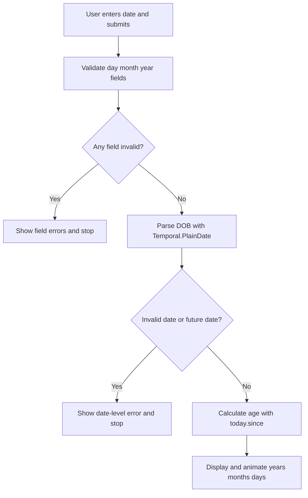

# Frontend Mentor - Age calculator app solution

This is a solution to the [Age calculator app challenge on Frontend Mentor](https://www.frontendmentor.io/challenges/age-calculator-app-dF9DFFpj-Q). Frontend Mentor challenges help you improve your coding skills by building realistic projects.

## Table of contents

- [Frontend Mentor - Age calculator app solution](#frontend-mentor---age-calculator-app-solution)
  - [Table of contents](#table-of-contents)
  - [Overview](#overview)
    - [The challenge](#the-challenge)
    - [Screenshot](#screenshot)
    - [Links](#links)
  - [My process](#my-process)
    - [Built with](#built-with)
    - [What I learned](#what-i-learned)
    - [Validation workflow](#validation-workflow)
    - [Continued development](#continued-development)
    - [Useful resources](#useful-resources)

**Note: Delete this note and update the table of contents based on what sections you keep.**

## Overview

### The challenge

Users should be able to:

- View an age in years, months, and days after submitting a valid date through the form
- Receive validation errors if:
  - Any field is empty when the form is submitted
  - The day number is not between 1-31
  - The month number is not between 1-12
  - The year is in the future
  - The date is invalid e.g. 31/04/1991 (there are 30 days in April)
- View the optimal layout for the interface depending on their device's screen size
- See hover and focus states for all interactive elements on the page
- **Bonus**: See the age numbers animate to their final number when the form is submitted

### Screenshot


### Links

- Solution URL: [Add solution URL here](https://your-solution-url.com)
- Live Site URL: [Add live site URL here](https://your-live-site-url.com)

## My process

### Built with

- Semantic HTML5 markup
- CSS custom properties
- Flexbox and CSS Grid
- Responsive layout with CSS `clamp()` and container queries
- Modern CSS selectors and states (`:has`, `:focus-visible`)
- Vanilla JavaScript with ES modules
- [Constraint Validation API](https://developer.mozilla.org/en-US/docs/Web/HTML/Constraint_validation)
- [Temporal API](https://tc39.es/proposal-temporal/) via `@js-temporal/polyfill`

### What I learned

This project helped me get hands-on with the **Constraint Validation API** and combine it with custom validation logic.

- I used `input.validity` to check specific states like `valueMissing`, `rangeUnderflow`, and `rangeOverflow`.
- I used `setCustomValidity()` to provide clear, field-specific error messages instead of generic browser text.
- I used `checkValidity()` as a clean gate before running age calculation logic.

I also learned how much cleaner date handling is with the **Temporal API**.

- `Temporal.PlainDate.from(dob, { overflow: "reject" })` is great for catching invalid dates such as 31/04.
- `Temporal.Now.plainDateISO()` gives a reliable "today" date for comparisons.
- `today.since(dob, { largestUnit: "year" })` made age breakdown into years, months, and days straightforward.

```js
const parsedDOB = Temporal.PlainDate.from(dob, { overflow: "reject" });
const today = Temporal.Now.plainDateISO();
const age = today.since(parsedDOB, { largestUnit: "year" });
```

### Validation workflow



### Continued development

I want to explore using CSS pseudo-classes for validation styling (`:invalid`, `:valid`, and related selectors) instead of setting `data-valid` attributes in JavaScript.

The goal is to keep visual validation states more declarative in CSS and reduce JS responsibilities to business logic and custom messages.

### Useful resources

- [MDN: Constraint validation](https://developer.mozilla.org/en-US/docs/Web/HTML/Constraint_validation) - Helpful for understanding `validity`, `checkValidity()`, and `setCustomValidity()`.
- [Temporal Proposal Docs](https://tc39.es/proposal-temporal/) - Helpful reference for `PlainDate` parsing, comparison, and duration calculations.
